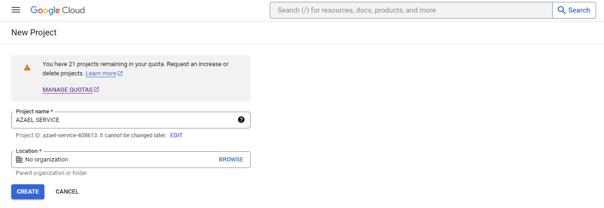
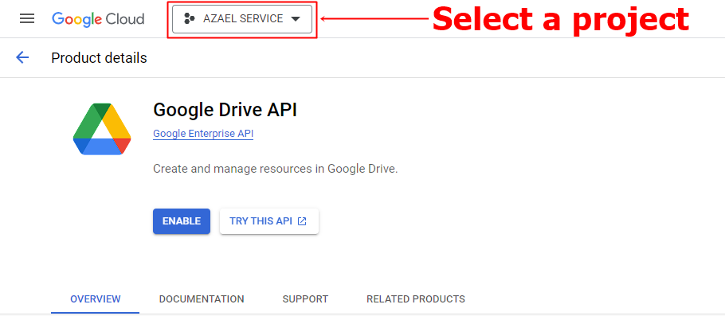
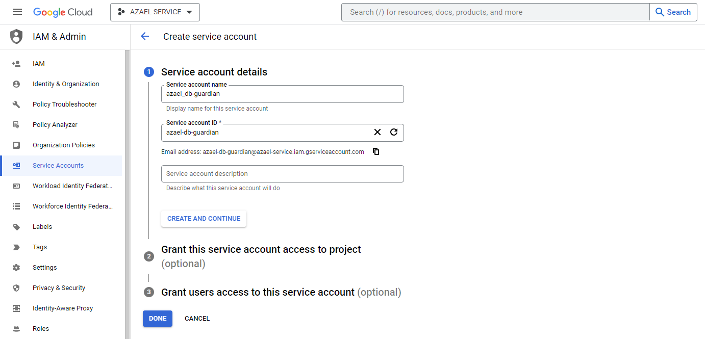
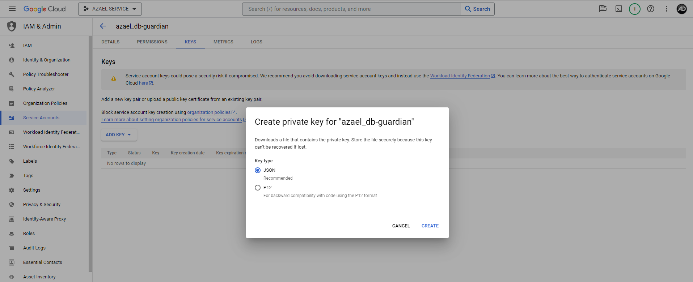

# Tutorials & Guides

บทช่วยสอนและคำแนะนำที่เกี่ยวข้องกับทรัพยากร **[azael_db-guardian](./)**

## Configuration

บทช่วยสอนและคำแนะนำที่เกี่ยวกับ **การกำหนดค่า**

### การกำหนดค่าเริ่มต้นที่จำเป็น

หากคุณใช้งานทรัพยากรนี้ในครั้งแรก โปรดดู **การกำหนดค่าเริ่มต้นที่จำเป็น** ตามลำดับด้านล่างนี้ได้

#### 1. ลบข้อมูลผู้เล่นออกจากฐานข้อมูลเซิร์ฟเวอร์

- [**UserIdle.LimitDays**](./config/server#useridlelimitdays)
- [**AutoDelete.Enable**](./config/server#autodeleteenable)
- [**IgnoreDelete.Enable**](./config/server#ignoredeleteenable)
- [**IgnoreDelete.Identifiers**](./config/server#ignoredeleteidentifiers)

#### 2. อัพเดทข้อมูลการเชื่อมต่อครั้งล่าสุดผู้เล่น

- [**LastSeen.MustBeOnline.Minutes**](./config/server#lastseenmustbeonlineminutes)
- [**LastSeen.PlayerDropped.Enable**](./config/server#lastseenplayerdroppedenable)

#### 3. สำรองฐานข้อมูลเซิร์ฟเวอร์

- [**Backup.ServerData.Enable**](./config/server#backupserverdataenable)
- [**Backup.ServerData.HourDist**](./config/server#backupserverdatahourdist)
- [**Backup.ServerData.DeleteOldFiles.Enable**](./config/server#backupserverdatadeleteoldfilesenable)
- [**Backup.ServerData.DeleteOldFiles.Days**](./config/server#backupserverdatadeleteoldfilesdays)

#### 4. สำรองข้อมูลผู้เล่นเมื่อถูกลบข้อมูล

- [**Backup.PlayerData.Enable**](./config/server#backupplayerdataenable)

#### 5. ไฟล์สำรองข้อมูล

- [**Backup.File.Extension**](./config/server#backupfileextension)
- [**Backup.File.GZIPCompression.Enable**](./config/server#backupfilegzipcompressionenable)

#### 5. ฐานข้อมูลเฟรมเวิร์กที่ใช้งาน

- [**Frameworks**](./config/server#frameworks-1)

#### 6. อัปโหลดไฟล์สำรองข้อมูล

- [**Option.Type**](./config/server#optiontype)
    - **Google Drive API (GCP)**
        - [**GoogleDriveAPI.DeleteOldFiles.Enable**](./config/server#googledriveapideleteoldfilesenable)
        - [**GoogleDriveAPI.DeleteOldFiles.Days**](./config/server#googledriveapideleteoldfilesdays)
        - [**GoogleDriveAPI.ServiceAccountKey**](./config/server#googledriveapiserviceaccountkey)
        - [**GoogleDriveAPI.SharedUsers**](./config/server#googledriveapisharedusers)
    - **Discord API (Webhook)**
        - [**DiscordAPI.MaxFileSize**](./config/server#discordapimaxfilesize)
        - [**DiscordAPI.ServerData.WebhookURL**](./config/server#discordapiserverdatawebhookurl)
        - [**DiscordAPI.PlayerData.WebhookURL**](./config/server#discordapiplayerdatawebhookurl)
    - **Custom API**
        - [**uploadFile (function)**](./public/fileupload)

#### 7. บันทึกที่กำหนดเอง (Logs)

- [**Enable.ExecuteCommand**](./config/server#enableexecutecommand)
- [**Enable.ServerBackup**](./config/server#enableserverbackup)
- [**Enable.DeletePlayerData**](./config/server#enabledeleteplayerdata)
- [**ExecuteCommand (function)**](./config/server#executecommand-function)
- [**ServerBackup (function)**](./config/server#serverbackup-function)
- [**DeletePlayerData (function)**](./config/server#deleteplayerdata-function)

## Operation Testing

บทช่วยสอนและคำแนะนำที่เกี่ยวกับ **การทดสอบการทำงาน**

### วิธีการทดสอบการทำงาน

หากคุณใช้งานทรัพยากรนี้ในครั้งแรก คุณสามารถดู **วิธีการทดสอบการทำงาน** ตามขั้นตอนด้านล่างนี้ได้

:::danger

การดำเนินการตามขั้นตอนด้านล่างนี้ เหมาะสำหรับเซิร์ฟเวอร์ที่มี **ฐานข้อมูลของผู้เล่น** อยู่แล้ว และ **ทดสอบการทำงาน** บน **เซิร์ฟเวอร์ทดสอบ**

:::

1. ดำเนินการ **สำรองฐานข้อมูลของเซิร์ฟเวอร์** ด้วยตนเอง (**สำรองข้อมูลเอาไว้เพื่อป้องกันการทำงานที่ผิดพลาด**)
2. ดำเนินการ **เริ่มต้นเซิร์ฟเวอร์ (FXServer)** และ [**`ensure azael_db-guardian`**](./) เพื่อให้ทรัพยากรนี้ **ติดตั้งฐานข้อมูลของทรัพยากรนี้** และดำเนินการ **คัดลอกข้อมูลของผู้เล่น** จากตารางของเฟรมเวิร์กที่ใช้งาน บนฐานข้อมูล
3. ดำเนินการ **ปิดเซิร์ฟเวอร์ (FXServer)** หาก [**azael_db-guardian**](./) ได้ **ติดตั้งฐานข้อมูลของทรัพยากรนี้** และ **คัดลอกข้อมูลของผู้เล่น** เสร็จสิ้นแล้ว (คุณสามารถตรวจสอบได้บน **ฐานข้อมูลของเซิร์ฟเวอร์** ตาราง **`azael_db_guardian`**)
4. ดำเนินการ นำเข้ารหัสด้านล่างนี้ไปยัง **ฐานข้อมูล** เพื่อ **ลดจำนวนวันลง 100 วัน** และ **จำกัดการอัปเดทจำนวน 100 แถว**

```sql title="Run SQL Query"
UPDATE azael_db_guardian SET lastseen = DATE_SUB(lastseen, INTERVAL 100 DAY) LIMIT 100;
```

5. ไปยังโฟลเดอร์ **`azael_data`** (ที่อยู่เดียวกันกับไฟล์ [**`server.cfg`**](https://docs.fivem.net/docs/server-manual/setting-up-a-server-vanilla/#servercfg)) และดำเนินการ ลบโฟลเดอร์ [**`azael_db-guardian`**](./)
6. ดำเนินการ **เริ่มต้นเซิร์ฟเวอร์ (FXServer)** และ [**`ensure azael_db-guardian`**](./) อีกครั้ง **เพือทดสอบการทำงาน** ของทรัพยากรนี้

:::tip

หากคุณดำเนินการ **ทดสอบการทำงานของทรัพยากรนี้** เสร็จสิ้น ให้ดำเนินการ **ลบฐานข้อมูลของเซิร์ฟเวอร์** ทิ้ง และนำเข้าไฟล์ **สำรองฐานข้อมูลของเซิร์ฟเวอร์** ที่ดำเนินการใน **ขั้นตอนที่ 1** ไปยัง **ฐานข้อมูลของเซิร์ฟเวอร์** ใหม่เพื่อใช้งาน

:::

## Database

บทช่วยสอนและคำแนะนำที่เกี่ยวกับ **ฐานข้อมูล**

### วิธีการนำเข้าฐานข้อมูลขั้นพื้นฐาน

คุณสามารถดูวิธีการนำเข้าฐานข้อมูลขั้นพื้นฐาน จากวีดีโอด้านล่างตามตัวเลือกที่คุณใช้งานใน [**HeidiSQL**](https://www.heidisql.com/), [**Navicat**](https://navicat.com/), [**phpMyAdmin**](https://www.phpmyadmin.net/)

<Tabs>
<TabItem value="heidisql" label="HeidiSQL">
    <iframe width="100%" height="444" src="https://www.youtube.com/embed/s3tqlHV3yb0?si=NqbnFdxosGUqHt9B&amp;start=7" title="YouTube video player" frameBorder="0" allow="accelerometer; autoplay; clipboard-write; encrypted-media; gyroscope; picture-in-picture" allowFullScreen></iframe>
</TabItem>
<TabItem value="navicat" label="Navicat">
    <iframe width="100%" height="444" src="https://www.youtube.com/embed/nUL1aelM0cM?si=-7wmT8ptojmnx5cT&amp;start=298" title="YouTube video player" frameBorder="0" allow="accelerometer; autoplay; clipboard-write; encrypted-media; gyroscope; picture-in-picture" allowFullScreen></iframe>
</TabItem>
<TabItem value="phpmyadmin" label="phpMyAdmin">
    <iframe width="100%" height="444" src="https://www.youtube.com/embed/_GgeT_DBawM?si=6bbv_c6P8t99iqml&amp;start=120" title="YouTube video player" frameBorder="0" allow="accelerometer; autoplay; clipboard-write; encrypted-media; gyroscope; picture-in-picture" allowFullScreen></iframe>
</TabItem>
</Tabs>

### วิธีการนำเข้าไฟล์ สำรองข้อมูลเซิร์ฟเวอร์

ขั้นตอนการนำเข้าไฟล์ **สำรองข้อมูลเซิร์ฟเวอร์** ไปยังฐานข้อมูลที่ถูกต้อง

1. ดำเนินการ **ปิดเซิร์ฟเวอร์ (FXServer)**
2. นำเข้าไฟล์ **สำรองข้อมูลเซิร์ฟเวอร์** ไปยังฐานข้อมูล

| Folder Name            | Folder Path
|------------------------|----------------------------------------------------
| `server-backups`       | `azael_data/azael_db-guardian/server-backups`

:::info

โฟลเดอร์ **`azael_data`** จะอยู่ที่อยู่เดียวกันกับไฟล์ **`server.cfg`**

:::

### วิธีการนำเข้าไฟล์ สำรองข้อมูลผู้เล่นที่ถูกลบ

ขั้นตอนการนำเข้าไฟล์ **สำรองข้อมูลผู้เล่นที่ถูกลบ** ไปยังฐานข้อมูลที่ถูกต้อง

1. ดำเนินการ **ปิดเซิร์ฟเวอร์ (FXServer)**
2. นำเข้าไฟล์ **สำรองข้อมูลผู้เล่นที่ถูกลบ** ไปยังฐานข้อมูล
3. ใช้งานคำสั่ง [**ยกเลิกสถานะถูกลบข้อมูลผู้เล่น**](./command#ยกเลิกสถานะถูกลบข้อมูลผู้เล่น) เพื่อให้ผู้เล่นสามารถเชื่อมต่อกับเซิร์ฟเวอร์ได้ตามปกติ

| Folder Name            | Folder Path
|------------------------|----------------------------------------------------
| `player-backups`       | `azael_data/azael_db-guardian/player-backups`

:::info

โฟลเดอร์ **`azael_data`** จะอยู่ที่อยู่เดียวกันกับไฟล์ **`server.cfg`**

:::

## Google Cloud Platform (GCP)

บทช่วยสอนและคำแนะนำที่เกี่ยวกับ [**Google Cloud Platform (GCP)**](https://cloud.google.com/gcp)

### วิธีการสร้างโครงการ GCP

คุณสามารถดูวิธีการสร้างโครงการ [**GCP**](https://cloud.google.com/gcp) ใน [**Google Cloud Console**](https://console.cloud.google.com/) ตามขั้นตอนด้านล่างนี้ได้

1. ไปที่หน้า [**Manage Resources**](https://console.cloud.google.com/cloud-resource-manager)
2. คลิก [**Create Project**](https://console.cloud.google.com/projectcreate) และป้อน **Project Name** เป็น **`AZAEL SERVICE`** หรือ ชื่อตามที่คุณต้องการ
3. เมื่อคุณป้อนรายละเอียดโครงการใหม่เสร็จแล้ว ให้คลิก **Create**



> **แหล่งที่มา:** https://cloud.google.com/resource-manager/docs/creating-managing-projects#creating_a_project

### วิธีการเปิดใช้งาน Google Drive API

คุณสามารถดูวิธีการเปิดใช้งาน [**Google Drive API**](https://console.cloud.google.com/apis/library/drive.googleapis.com) ใน [**Google Cloud Console**](https://console.cloud.google.com/) ตามขั้นตอนด้านล่างนี้ได้

1. ไปที่หน้า [**API Library**](https://console.cloud.google.com/apis/library)
2. ค้นหา [**`Google Drive API`**](https://console.cloud.google.com/apis/library/browse?q=Google%20Drive%20API) และคลิก [**Google Drive API**](https://console.cloud.google.com/apis/library/drive.googleapis.com) 
3. เมื่อคุณเลือกโครงการที่ต้องการเปิดใช้งานเสร็จแล้ว ให้คลิก **Enable**

:::caution

หากคุณยังไม่ได้ดำเนินการตามรายการด้านล่างนี้ โปรดดำเนินการก่อน [**เปิดใช้งาน Google Drive API**](./tutorial#วิธีการเปิดใช้งาน-google-drive-api)
- [**สร้างโครงการ GCP**](./tutorial#วิธีการสร้างโครงการ-gcp)

:::



### วิธีการสร้างบัญชีบริการ (Service Accounts)

คุณสามารถดูวิธีการสร้างบัญชีบริการ ([**Service Accounts**](https://console.cloud.google.com/iam-admin/serviceaccounts)) ใน [**Google Cloud Console**](https://console.cloud.google.com/) ตามขั้นตอนด้านล่างนี้ได้

1. ไปที่หน้า [**Service Accounts**](https://console.cloud.google.com/iam-admin/serviceaccounts)
2. เลือก **โครงการ** ที่คุณต้องการ
3. คลิก [**Create Service Account**](https://console.cloud.google.com/iam-admin/serviceaccounts/create) เพื่อสร้าง
4. ป้อน **Service Account Name** เป็น **`azael_db-guardian`** หรือ ชื่อตามที่คุณต้องการ
5. เมื่อคุณป้อนรายละเอียดบัญชีบริการเสร็จแล้ว ให้คลิก **Done**

:::caution

หากคุณยังไม่ได้ดำเนินการตามรายการด้านล่างนี้ โปรดดำเนินการก่อน [**สร้างบัญชีบริการ (Service Accounts)**](./tutorial#วิธีการสร้างบัญชีบริการ-service-accounts)
- [**สร้างโครงการ GCP**](./tutorial#วิธีการสร้างโครงการ-gcp)
- [**เปิดใช้งาน Google Drive API**](./tutorial#วิธีการเปิดใช้งาน-google-drive-api)

:::



> **แหล่งที่มา:** https://cloud.google.com/iam/docs/service-accounts-create#creating

### วิธีการสร้างกุญแจบัญชีบริการ (Service Account Key)

คุณสามารถดูวิธีการสร้างกุญแจบัญชีบริการ ([**Service Account Key**](https://console.cloud.google.com/iam-admin/serviceaccounts)) ใน [**Google Cloud Console**](https://console.cloud.google.com/) ตามขั้นตอนด้านล่างนี้ได้

1. ไปที่หน้า [**Service Accounts**](https://console.cloud.google.com/iam-admin/serviceaccounts)
2. เลือก **โครงการ** ที่คุณต้องการ
3. คลิก **Actions** (สัญลักษณ์ <Icon icon="fa-solid fa-ellipsis-vertical" size="lg" /> ) จากบัญชีบริการ (**Email**) ที่คุณต้องการ
4. เลือก **Manage keys**
5. คลิก **Add Key** เลือก **Create New Key**
6. เลือก **Key Type** เป็น **JSON** แล้วดำเนินการคลิก **Create**
7. ดาวน์โหลดไฟล์ **`service_account_key.json`** ลงในอุปกรณ์ของคุณ
8. นำข้อมูล **`client_email`** และ **`private_key`** ที่ได้จากไฟล์ ไปกำหนดยัง [**GoogleDriveAPI.ServiceAccountKey**](./config/server#googledriveapiserviceaccountkey)

:::caution

หากคุณยังไม่ได้ดำเนินการตามรายการด้านล่างนี้ โปรดดำเนินการก่อน [**สร้างกุญแจบัญชีบริการ**](./tutorial#วิธีการสร้างกุญแจบัญชีบริการ-service-account-key)
- [**สร้างโครงการ GCP**](./tutorial#วิธีการสร้างโครงการ-gcp)
- [**เปิดใช้งาน Google Drive API**](./tutorial#วิธีการเปิดใช้งาน-google-drive-api)
- [**สร้างบัญชีบริการ (Service Accounts)**](./tutorial#วิธีการสร้างบัญชีบริการ-service-accounts)

:::



## Google Drive API

บทช่วยสอนและคำแนะนำที่เกี่ยวกับ [**Google Drive API**](https://developers.google.com/drive/api/guides/about-sdk)

### วิธีการเพิ่มสิทธิ์เข้าถึง Google Drive

คุณสามารถดูวิธีการเพิ่มสิทธิ์เข้าถึง [**Google Drive**](https://drive.google.com/drive/shared-with-me) ตามขั้นตอนด้านล่างนี้ได้

1. ไปที่ [**`config/server.config.lua`**](./config/server) การกำหนดค่า [**GoogleDriveAPI.SharedUsers**](./config/server#googledriveapisharedusers)
2. เพิ่มบัญชี [**Gmail**](https://myaccount.google.com) ที่คุณต้องการให้สิทธิ์เข้าถึงไดฟ์

:::info
    - จะมีผลก็ต่อเมื่อทรัพยากร [**azael_db-guardian**](./) เริ่มต้นใหม่
    - สามารถดูไดฟ์ที่เเชร์ได้ที่ [**Google Drive (Shared)**](https://drive.google.com/drive/shared-with-me)
:::

### วิธีการยกเลิกสิทธิ์เข้าถึง Google Drive

คุณสามารถดูวิธีการเพิ่มสิทธิ์เข้าถึง [**Google Drive**](https://drive.google.com/drive/shared-with-me) ตามขั้นตอนด้านล่างนี้ได้

1. ไปที่ [**`config/server.config.lua`**](./config/server) การกำหนดค่า [**GoogleDriveAPI.SharedUsers**](./config/server#googledriveapisharedusers)
2. ลบบัญชี [**Gmail**](https://myaccount.google.com) ที่คุณต้องการยกเลิกสิทธิ์เข้าถึงไดฟ์

:::info
    - จะมีผลก็ต่อเมื่อทรัพยากร [**azael_db-guardian**](./) เริ่มต้นใหม่
    - สามารถดูไดฟ์ที่เเชร์ได้ที่ [**Google Drive (Shared)**](https://drive.google.com/drive/shared-with-me)
:::

### คำสั่งที่สามารถใช้งานได้ใน Google Drive

คุณสามารถดูคำสั่ง [**Google Drive**](https://drive.google.com/drive/shared-with-me) ตามรายการด้านล่างนี้ได้

#### Server Backups:
- [**รับรายชื่อไฟล์ สำรองข้อมูลเซิร์ฟเวอร์**](./command#รับรายชื่อไฟล์-สำรองข้อมูลเซิร์ฟเวอร์)
- [**ลบไฟล์ สำรองข้อมูลเซิร์ฟเวอร์ (ระบุชื่อไฟล์)**](./command#ลบไฟล์-สำรองข้อมูลเซิร์ฟเวอร์-ระบุชื่อไฟล์)
- [**ลบไฟล์ สำรองข้อมูลเซิร์ฟเวอร์ (ทั้งหมด)**](./command#ลบไฟล์-สำรองข้อมูลเซิร์ฟเวอร์-ทั้งหมด)

#### Player Backups:
- [**รับรายชื่อไฟล์ สำรองข้อมูลผู้เล่น**](./command#รับรายชื่อไฟล์-สำรองข้อมูลผู้เล่น)
- [**ลบไฟล์ สำรองข้อมูลผู้เล่น (ระบุชื่อไฟล์)**](./command#ลบไฟล์-สำรองข้อมูลผู้เล่น-ระบุชื่อไฟล์)
- [**ลบไฟล์ สำรองข้อมูลผู้เล่น (ทั้งหมด)**](./command#ลบไฟล์-สำรองข้อมูลผู้เล่น-ทั้งหมด)

:::caution

- จำเป็นที่จะต้องกำหนด [**Option.Type**](./config/server#optiontype) เป็น **`1`** จึงจะสามารถใช้งานคำสั่งเหล่านี้ได้ (อัปโหลดไฟล์ไปยัง [**Google Drive API (GCP)**](https://console.cloud.google.com/apis/library/drive.googleapis.com))
- สามารถใช้งานคำสั่งเหล่านี้ได้ทางฝั่ง [**Server**](https://en.wikipedia.org/wiki/Server-side) เท่านั้น ไม่สามารถใช้งานทางฝั่ง [**Client**](https://en.wikipedia.org/wiki/Client-side) ได้

:::

import Tabs from '@theme/Tabs';
import TabItem from '@theme/TabItem';
